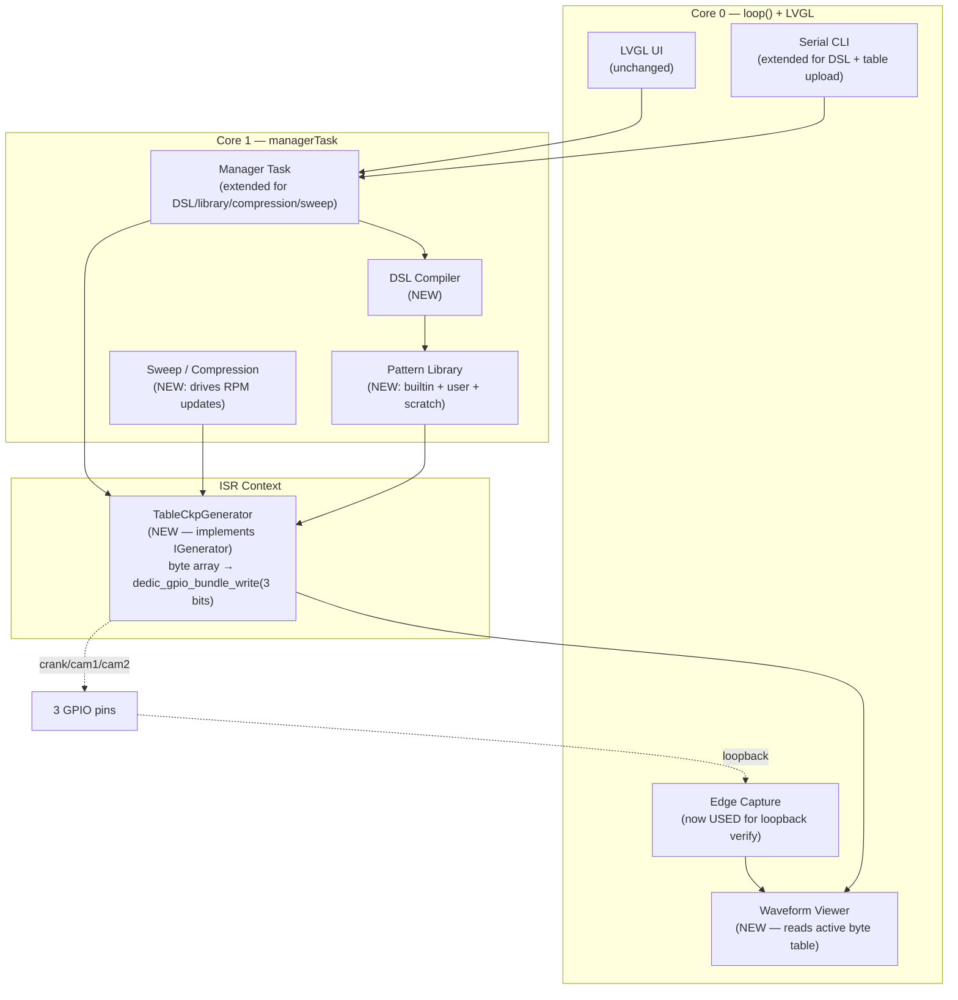

# ESP32 Signal Generator — Integration Report: Adopting the Ardu-Stim Approach

> **Purpose.** Upgrade the ESP32-S3 CKP Signal Generator (currently 5 algorithmically-generated patterns, single channel) into a full **CKP + CMP + CMP2** synchronized engine-signal generator capable of replaying **any arbitrary trigger pattern** — by porting the table-driven architecture from Ardu-Stim, layering on the runtime pattern DSL the Ardu-Stim author sketched but never implemented, and exploiting ESP32-S3 hardware where it materially improves on the AVR.

---

## Table of Contents

1. [Executive Summary & Verdict](#1-executive-summary--verdict)
2. [Side-by-Side Architectural Comparison](#2-side-by-side-architectural-comparison)
3. [What Each Project Does Well (and Badly)](#3-what-each-project-does-well-and-badly)
4. [The Crown Jewel: Ardu-Stim's Byte-Packed Multi-Channel Table](#4-the-crown-jewel-ardu-stims-byte-packed-multi-channel-table)
5. [Recommended Target Architecture](#5-recommended-target-architecture)
6. [Pattern Library Port Plan](#6-pattern-library-port-plan)
7. [Pattern DSL — Closing Out the Original TODO](#7-pattern-dsl--closing-out-the-original-todo)
8. [ESP32-S3 Output Backend — Detailed Alternatives & Primary Choice](#8-esp32-s3-output-backend--detailed-alternatives--primary-choice)
9. [Porting the Smart Auxiliary Features](#9-porting-the-smart-auxiliary-features)
10. [Mapping the Existing ESP32 Architecture Onto the New Model](#10-mapping-the-existing-esp32-architecture-onto-the-new-model)
11. [Migration Roadmap (Phased)](#11-migration-roadmap-phased)
12. [Open Questions](#12-open-questions)

---

## 1. Executive Summary & Verdict

The Ardu-Stim firmware is a **richly populated, table-driven, multi-channel** engine simulator that has been refined since 2014. Its core data structure — a flat byte array per pattern where each byte's low 3 bits drive three GPIO pins in lockstep through a single AVR `PORTB` register write — is the single most important idea to steal. It gives **64 production-grade trigger patterns**, **perfect CKP/CAM phase synchronization** by construction, **instant RPM changes** (a one-register timer-reload), and a memory footprint of **~14.6 KB total** for the entire library — i.e. essentially free on any ESP32-S3.

The current ESP32 generator's slot-machine algorithm is elegant and deterministic but **cannot represent** the irregular, multi-channel, angularly-defined patterns that real engines use (Optispark LT1, Nissan 360 CAS, Audi 135, GM LS1, Lotus 36-1-1-1-1, Buell oddfire, …). It also has only **one output channel**, no compression simulation, no sweep mode, and a hardcoded library of 5 presets.

**Verdict:** Replace the slot-machine algorithm with **a direct port of Ardu-Stim's table-walking timer ISR**, keep ESP32's superior infrastructure (LVGL UI, FreeRTOS message queue, validation/rollback, edge capture), and add **a runtime DSL compiler** so users can author patterns without recompiling firmware — the feature the Ardu-Stim author wanted but couldn't fit on AVR. The result is a strict superset of both projects.

A single recommended hardware backend: **GPTimer ISR + `dedic_gpio` bundle writes**. RMT was evaluated and rejected as primary because its baked-in durations make RPM changes a heavyweight operation; LCD_CAM is held in reserve as the path to ultra-high-RPM patterns if profiling reveals an ISR ceiling.

---

## 2. Side-by-Side Architectural Comparison

| Dimension | Ardu-Stim (AVR) | ESP32 Signal Generator (current) | Proposed (merged) |
|---|---|---|---|
| **Output channels** | 3 (crank, cam1, cam2) via one `PORTB` write | 1 (CKP only) | **3** (CKP, CMP, CMP2) via dedic_gpio bundle |
| **Pattern source** | 64 hand-crafted byte arrays in `wheel_defs.h` | 5 algorithmic patterns + custom params | **64 ported tables + DSL-compiled tables + serial-uploaded tables** |
| **Pattern representation** | 1 byte/slot, bit-packed channels | `SignalConfig` struct (nTeeth/pMiss/nMiss/gapPos/gapLvl) | **Byte-packed table (Ardu-Stim format) — `SignalConfig` retained for DSL "symmetric/missing" inputs that compile down to a table** |
| **Output mechanism** | Timer1 ISR walking array → `PORTB = …` | GPTimer ISR computing level from slot index | **GPTimer ISR walking array → `dedic_gpio_bundle_write(...)`** |
| **Max RPM at 720-edge pattern** | ~15 k (ISR saturation) | N/A (no such pattern supported) | **~30 k+** (dedic_gpio asm path) |
| **RPM precision** | OCR1A with 5-stage prescaler (1/8/64/256/1024) | GPTimer 64-bit counter @ 80 MHz | **GPTimer 64-bit, no prescaler juggling needed** |
| **Sweep mode** | `LINEAR_SWEPT_RPM`, ±1 RPM per `sweep_interval` µs | Not implemented | **Linear sweep + log sweep + waypoint sweep** |
| **Compression simulation** | sin tables (180°/120°/90°), per-cycle modifier, optional RPM-dependent amplitude | Not implemented | **Full port + per-cylinder profiles + custom waveform option** |
| **Persistence** | EEPROM (packed `configTable`) | NVS (implied) | **NVS for settings, LittleFS for user DSL patterns + compiled cache** |
| **Pattern definition runtime** | None — recompile firmware to add patterns | None — `SignalConfig` only | **DSL parser (Symmetric / Missing / Angular, multi-wheel groups, `:`-separated)** |
| **UI** | None (serial only) | LVGL touchscreen + serial CLI | **LVGL + serial + (optional) Web UI** |
| **Validation** | Implicit (wheel ID bounded) | Validation + `lastGood` rollback in manager task | **Retained as-is; DSL adds 12 compile-time checks** |
| **Inter-component sync** | Single ISR | FreeRTOS queue → manager → IGenerator | **Retained as-is; new generator behind same `IGenerator` interface** |
| **Capture** | None | `EdgePulseCapture` (unused) | **Used for loopback validation + waveform display** |

---

## 3. What Each Project Does Well (and Badly)

### Ardu-Stim — Strengths

- **Multi-channel byte-packed encoding.** One read, one register write, three pins flip atomically. CKP/CAM phase relationship is encoded in the data, not enforced by timing — making it physically impossible to desync. (`ardustim.ino:263`)
- **Massive pattern library.** 64 real-world patterns (`Wheels[]` at `ardustim.ino:59-125`), covering distributor, missing-tooth crank, dual-ring crank+cam, angular/odd-fire, multi-gap, exotic OEM patterns (Optispark, Nissan 360 CAS, Audi 135, GM LS1, Subaru 6/7, Mazda 36-2-2-2 + 6T cam, etc.).
- **`rpm_scaler` normalization.** Each wheel's `rpm_scaler = edges/120` so the timer formula `8000000 / (rpm_scaler × rpm)` produces a consistent perceived RPM regardless of edge count. (`globals.h:73`, `ardustim.ino:408`)
- **Prescaler-switching strategy.** Five prescaler stages let a 16-bit OCR1A cover the full RPM range; the `reset_prescaler` deferred-apply flag avoids mid-ISR glitches. (`ardustim.ino:439-466`)
- **Compression simulation.** Three sin tables (`sin_100_180/120/90` in `globals.h:80-120`) subtract a per-stroke modifier from base RPM when below `compressionRPM`, optionally scaled linearly with RPM. The result is realistic cranking behavior — a feature most engine simulators lack.
- **Sweep mode in `loop()`, not in ISR.** Timer2 is set up but its interrupt is intentionally disabled (`ardustim.ino:163`); sweep timing is driven by `micros()` checks in the main loop, keeping the audio-rate ISR untouched.
- **Tiny serial protocol.** Single-byte commands, `configTable` IS the wire format. No framing, no acks, just lockstep agreement on a packed struct. Easy to bridge to anything.
- **Output inversion** via XOR mask, computed in the ISR (`ardustim.ino:263` — `output_invert_mask ^ pgm_read_byte(...)`).

### Ardu-Stim — Weaknesses

- AVR memory pressure caps the library (TODO L2-4 frets about flash space).
- No runtime pattern definition — every new pattern needs a firmware rebuild AND adding an entry to `Wheels[]` in the exact correct position (the index is part of the wire protocol).
- ISR ceiling forces a soft cap around 15k RPM on 720-edge patterns.
- No UI; serial only.
- No validation/rollback layer — bad config can crash the running pattern.
- Wheel ordering in `Wheels[]` is part of the API (saved EEPROM `config.wheel` is an index). Inserting in the middle breaks every saved state.

### ESP32 Generator — Strengths

- **Clean three-layer architecture.** UI / message queue / generator. Hardware abstracted behind `IGenerator` — a new backend can be dropped in without touching the queue, manager, or UI.
- **FreeRTOS message queue + manager task.** All user intent funnels through one queue; no UI-to-ISR shortcuts. Easy to reason about.
- **Validation + `lastGood` rollback.** Bad configs revert atomically.
- **Pending-flag UI sync** with `portMUX_TYPE` spinlock — clean Core 0 ↔ Core 1 protocol that survives the LVGL/FreeRTOS coexistence problem.
- **Real hardware to exploit:** 240 MHz dual-core, 8 MB PSRAM, 4 MB flash, GPTimer at 80 MHz, RMT × 8 channels, LCD_CAM parallel I/O DMA, dedic_gpio (12-cycle GPIO writes), MCPWM.
- **LVGL UI** with arc dial, dropdown, custom modal, status flashes.
- **Edge capture subsystem** already wired up (just unused).

### ESP32 Generator — Weaknesses

- **Algorithmic generation can't represent angular / odd-fire / dual-gap patterns.** The `nTeeth/pMiss/nMiss/gapPos/gapLvl` model is a strict subset of "evenly-spaced teeth with one regular gap pattern". Optispark, Nissan 360 CAS, Audi 135, GM LS1, Lotus 36-1-1-1-1, Buell oddfire — none expressible.
- **Single channel.** No CMP, no CMP2.
- **Only 5 presets.** Hard-coded in `patternFromIndex()`.
- **No compression simulation, no sweep, no log sweep.**
- **`EdgePulseCapture` is dead code** — fetched and discarded.
- **No waveform visualization** despite having a 480×272 LCD perfect for it.

---

## 4. The Crown Jewel: Ardu-Stim's Byte-Packed Multi-Channel Table

Every patternable engine signal Ardu-Stim supports is a flat array of `uint8_t` in PROGMEM. **The encoding is 1 byte per "slot"** (a slot is the smallest time unit needed to express the pattern — typically 1 crank degree for high-resolution patterns, more for simple ones). Each byte's bits encode the simultaneous states of multiple output pins:

| Bit | Pin (Nano) | Channel |
|---|---|---|
| 0 (value 1) | D8 (PB0) | crank |
| 1 (value 2) | D9 (PB1) | cam1 |
| 2 (value 4) | D10 (PB2) | cam2 |
| 3 (value 8) | D11 (PB3) | knock (reserved, unused in ISR) |

Byte values are pre-OR'd combinations: `3` = crank+cam1 high, `5` = crank+cam2 high, `7` = all three, `0` = all low.

The ISR is **three instructions of real work**:

```c
ISR(TIMER1_COMPA_vect) {
  PORTB = output_invert_mask ^ pgm_read_byte(&Wheels[config.wheel].edge_states_ptr[edge_counter]);
  edge_counter++;
  if (edge_counter == Wheels[config.wheel].wheel_max_edges) { edge_counter = 0; /* cycle bookkeeping */ }
  // prescaler / OCR1A reload
}
```

**Why this is so good:**

1. **CKP/CAM are atomic-by-construction.** A single store cannot tear; the three pins flip on the same CPU cycle. No software synchronization, no PLL, no shared timer-base juggling.
2. **Adding a new pattern is data-only.** Append an array to `wheel_defs.h`, add one row to `Wheels[]`. No control-flow changes, no special cases in the ISR.
3. **The table IS the visualization.** Render the array directly to draw the waveform.
4. **The table IS the wire format.** Serial command `P` dumps `edge_states_ptr` as CSV; the GUI's scope view reads exactly that.
5. **Polarity inversion is free.** XOR mask in the same instruction.

The current ESP32 generator's slot-machine ISR is at heart trying to re-derive this byte from `(sip, gapPos, gapLvl, ...)` every interrupt. Replacing it with a table read is a strict win on every axis except memory — and on ESP32 that constraint vanishes.

---

## 5. Recommended Target Architecture



**Invariants preserved from current ESP32 architecture:**

- `IGenerator` interface stays the contract between manager and backend. The new `TableCkpGenerator` implements it; the old `TimerCkpGenerator` becomes a deprecated legacy backend that can be removed once parity is confirmed.
- FreeRTOS queue, manager task, validation + `lastGood` rollback all unchanged.
- LVGL pending-flag UI sync unchanged.

**Net change:** the generator backend swaps from "compute level from (sip, params)" to "read byte from table, mask, write 3 bits". Everything downstream of `apply(cfg)` is new code; everything upstream of it is unchanged.

---

## 6. Pattern Library Port Plan

### 6.1 Source data

`\\wsl.localhost\Ubuntu\home\mfares\0.Projects\Ardu-Stim-master\ardustim\ardustim\wheel_defs.h` contains 64 byte arrays plus their friendly-name strings. Total runtime cost: **~14.6 KB** of pattern data + ~2 KB of name strings.

Largest patterns: Audi 135 with cam (1080 bytes), Optispark LT1 (720), Nissan 360 CAS (720), GM LS1 (720), Chrysler NGC variants (720 each), Volvo D12ACD with cam (480), Mazda 36-2-2-2 + 6T cam (360). All easily fit in ESP32-S3 flash.

### 6.2 Mechanical port

Three transformations make the C source land cleanly on Arduino-ESP32:

1. **Remove `PROGMEM`.** ESP32 Xtensa has memory-mapped flash via instruction cache; `const uint8_t arr[]` lands in `.rodata` and is read with normal load instructions. No `pgm_read_byte()` wrapper needed.
2. **Remove the `pgm_read_byte()` indirection** in the ISR and in the `Wheels[]` field accessors.
3. **Add `IRAM_ATTR`** to the ISR so it runs from IRAM and isn't subject to flash cache misses during operation. Same for any helper called from ISR.

### 6.3 Wheels table

Port `Wheels[]` verbatim with one structural change: add **per-channel pin mapping** (which physical GPIO each channel byte-bit drives). On Ardu-Stim this was hardcoded to `PORTB[0..2]`; on ESP32 it's `dedic_gpio` bundle indices, configurable at boot via NVS.

```c
struct WheelMeta {
    const char *name;
    const uint8_t *edges;           // byte-packed table in flash
    uint16_t  max_edges;
    uint16_t  wheel_degrees;        // 360 or 720
    float     rpm_scaler;           // max_edges / 120.0
    uint8_t   channel_mask;         // which of bits 0..2 are actually used
};
```

`channel_mask` is new and lets the UI grey out unused channels in the visualizer.

### 6.4 Wheel-ID stability

In Ardu-Stim, the array index is part of the wire protocol and EEPROM-stored config. The ESP32 port should **break this dependency on first migration**: store wheels by string key (`"sixty_minus_two"`, `"audi_135_with_cam"`) so adding/reordering doesn't shift saved selections. Provide a one-shot legacy-ID-to-key migration when reading old NVS records.

---

## 7. Pattern DSL — Closing Out the Original TODO

The Ardu-Stim `TODO` file describes a runtime DSL the author wanted but couldn't fit on AVR. ESP32 has the resources; we should implement it.

### 7.1 Grammar (BNF)

```bnf
<pattern-group>   ::= <wheel-def> { ":" <wheel-def> }
<wheel-def>       ::= <pin> "," <rot> "," <kind> "," <kind-tail>
<pin>             ::= "1" | "2" | "3" | "4"
<rot>             ::= "C" | "c"                  ; C = crank/360°, c = cam/720°  (TODO L28-29)
<kind>            ::= "A" | "S" | "M"            ; Angular, Symmetric, Missing   (TODO L30)
<kind-tail>       ::= <sym-tail> | <miss-tail> | <ang-tail>

<sym-tail>        ::= <duty> "," <total-teeth>                          ; (TODO L37-39)
<miss-tail>       ::= <duty> "," <total-teeth> "," <run-list>           ; (TODO L41-44)
<ang-tail>        ::= <int> { "," <int> }                               ; alternating H,L durations in degrees

<duty>            ::= <int> "/" <int>            ; numerator < denominator
<run-list>        ::= <run> { "," <run> }
<run>             ::= <int> ("t" | "m")          ; t = present teeth, m = missing teeth
```

Worked examples:

| Description | DSL |
|---|---|
| 4-cyl distributor (2 teeth/rev, 50%) | `1,C,S,1/2,2` |
| 60-2 crank + half-moon cam | `1,C,M,1/2,60,58t,2m : 2,c,S,1/2,1` |
| Nissan 360 CAS + sync slot | `1,C,S,1/2,360 : 2,C,A,40,20,40,20,40,20,40,20,40,20,40,20` |
| 36-1 with cam sync pulse | `1,C,M,1/2,36,35t,1m : 2,c,A,10,710` |

### 7.2 Compilation to the runtime byte table

The DSL parser produces an intermediate edge list per wheel, then merges them into Ardu-Stim's byte-packed format:

1. **Per-wheel slot count.** Symmetric/Missing: `slots = total_teeth × duty_denominator` (TODO L66-70). Angular: emit one slot per degree (option 1 from TODO L77-83 → 360 or 720 bytes; option 2 = GCD-reduce when memory pressure is high).
2. **Cam-doubling.** If any wheel is cam, double the crank wheels so all span 720° (TODO L87-88).
3. **LCM merge.** Compute `L = lcm(slots_1, slots_2, …)`. Resample each wheel to length `L` by integer repetition. Merge by OR-ing bit `(pin-1)` of each wheel into a `uint8_t[L]`.
4. **Metadata.** `{slot_count: L, degrees: 360|720, rpm_scaler: L/120, channel_mask, source_dsl_hash}`.

Concrete trace for `"1,C,M,1/2,36,35t,1m : 2,c,S,1/2,1"`: wheel A is 72 slots over 360° (after doubling to 144 over 720°), wheel B is 2 slots over 720°. `L = lcm(144, 2) = 144`. Result is 144 bytes: first ~70 alternating `0x03/0x02` (crank teeth with cam HIGH), then `0x02 × 2` (missing teeth with cam still HIGH), then 72 bytes of `0x01/0x00` (cam LOW half of the cycle).

### 7.3 Memory budget on ESP32-S3

- Symmetric/Missing: `teeth × duty_denominator` bytes; worst real case `36 × 13 = 468` bytes (TODO L71-73).
- Angular option 1: 360 (crank) or 720 (cam) bytes flat.
- Group LCM × cam-doubling factor.

Even with a generous 4096-byte per-group ceiling and 100 user patterns stored, total usage is < 500 KB — trivial against 4 MB flash / 8 MB PSRAM.

### 7.4 Storage tiers

- **`builtin/<name>`** — the 64 ported Ardu-Stim tables, baked into firmware flash. Immutable.
- **`user/<name>`** — DSL source + compiled byte cache, in LittleFS at `/patterns/<name>.{dsl,bin}`. Persistent, renameable.
- **`tmp/scratch`** — RAM-only slot, last serial-uploaded pattern, replaced on next upload, lost on reboot.

A single `LIST` serial command (and equivalent UI dropdown) enumerates all three tiers in one flat namespace.

### 7.5 Validation rules (compiler enforces)

1. Pin in `{1,2,3,4}`; unique within group.
2. 1–4 wheels per group.
3. `<kind>` tail shape matches kind.
4. Duty `n/d`: `0 < n < d`, `d ≤ 32`.
5. Symmetric/Missing slot count ≥ 2.
6. Missing wheel: `Σ t-counts + Σ m-counts == total_teeth`, at least one `m` entry.
7. Angular crank sums to exactly 360; cam sums to 720 (TODO L34-35).
8. Angular entries positive.
9. Computed `L` ≤ 4096 bytes.
10. Channel mask non-zero.
11. DSL source ≤ 512 chars.
12. No duplicate identical wheel definitions within a group.

### 7.6 Items from TODO that are now obsolete or v2

- "Flash-speed worry" (TODO L2-4) — obsolete; ESP32 caches flash transparently.
- "Drop t/m suffixes to save flash" (TODO L45-46) — obsolete; keep suffixes for validation value.
- `*N` repeat shortcut (TODO L18-19) — defer to v2; `35t,1m` is fine as-is for the patterns that exist today.

The "starting position doesn't matter, pattern is cyclic" remark (TODO L51-54) becomes a useful canonicalization rule: rotate every compiled buffer so slot 0 is a rising edge of the lowest-numbered active pin. This dedups identical patterns saved at different rotational phases.

---

## 8. ESP32-S3 Output Backend — Detailed Alternatives & Primary Choice

Four hardware paths were evaluated for the actual byte → pin emission.

### 8.1 GPTimer ISR + dedic_gpio bundle (RECOMMENDED — primary)

GPTimer running at 80 MHz tick, ISR fires once per slot, ISR reads one byte from the active pattern table, masks, writes 3 bits via the dedic_gpio peripheral.

- **GPIO write cost:** `dedic_gpio_bundle_write()` ≈ 420 ns from C; the raw PIE assembly (`ee.set_bit_gpio_out` / `ee.clr_bit_gpio_out`) is ~12 ns. Plain `GPIO.out_w1ts` writes ~60 ns.
- **ISR latency:** ~2 µs C-level entry on S3 under Arduino-ESP32; tighter when pinned to Core 1 with WiFi/BT on Core 0 and `ESP_INTR_FLAG_LEVEL3`.
- **Comfortable edge rate:** ~50 kHz (one ISR per 20 µs), enough for Optispark/Nissan @ 8000 RPM (≈48 kHz edges).
- **Max edge rate (asm path):** ~200 kHz, giving headroom even for Audi 135 at high RPM.
- **RPM change:** rewrite one register (`gptimer_set_alarm_action`). **Next edge** uses the new period. Sweep mode is trivial.
- **CKP/CAM sync:** physically perfect — one register write per slot drives all 3 bits.
- **Memory:** trivial (the byte table is the only state).

**This is the direct ESP32-S3 analog of Ardu-Stim's Timer1 ISR.** It preserves every architectural strength of the Ardu-Stim approach and only swaps the platform-specific GPIO write instruction.

### 8.2 RMT with sync manager (REJECTED as primary)

ESP32-S3 RMT has 4 TX channels, supports DMA-fed item streams, infinite-loop mode (`loop_count = -1`), and a `rmt_sync_manager` that phase-locks multi-channel starts. Edge-rate ceiling is effectively the tick clock (10 MHz / 100 ns easily achievable) so **upper-RPM limits would be far higher than 8.1**.

But the killer is **RPM change latency.** Every duration is baked into `rmt_symbol_word_t`. To change RPM you either:

- Regenerate the entire item buffer (worst case 1080 symbols × 3 channels × 4 bytes = 13 KB) and double-buffer-swap → glitches at the seam,
- or `rmt_disable() → reconfigure → rmt_enable()` → milliseconds of dead air.

Neither works for the linear-sweep mode that's a flagship Ardu-Stim feature. **Hold RMT in reserve** for a specialty mode (e.g., a "frozen RPM, maximum edge rate" mode for Audi 135 stress testing) but not the default backend.

### 8.3 LCD_CAM parallel-I/O DMA (HELD IN RESERVE)

The S3's LCD_CAM peripheral can stream 8-bit parallel data via GDMA at up to 40 MHz pixel clock. **This is the closest hardware analog to "PORTB write per tick"** in all of ESP32 — you literally stream bytes to an 8-bit bus whose lower 3 bits become the crank/cam1/cam2 outputs.

- **Edge rate ceiling:** essentially unlimited (40 MHz pixel clock).
- **RPM change:** reprogram the LCD pixel clock divider — one MMIO register write, next byte clocks at the new rate. **Better than the timer-ISR approach for RPM-change latency.**
- **CPU cost:** zero steady-state.
- **Sync:** perfect by construction.
- **Memory:** 1× buffer in DMA-accessible memory.

Downsides: implementation effort is significantly higher (GDMA descriptor chains, pin-mux routing of LCD_DATA0..2). Reserve as **upgrade path** for the unlikely case that the ISR backend hits its ceiling on the highest-edge-count patterns, or as a future "perfect determinism" mode.

### 8.4 MCPWM (REJECTED)

Designed for PWM with table-driven duty, not arbitrary multi-bit patterns. Wrong tool.

### 8.5 Realistic upper-RPM limits per backend

| Backend | Optispark 720 ed/720° | Audi 135 1080 ed/720° |
|---|---|---|
| GPTimer ISR + dedic_gpio C  | ~8,300 RPM | ~5,500 RPM |
| GPTimer ISR + dedic_gpio asm | ~33,000 RPM | ~22,000 RPM |
| RMT sync group | >60,000 RPM (but no sweep) | >60,000 RPM (but no sweep) |
| LCD_CAM | unlimited | unlimited |
| Ardu-Stim AVR (reference) | ~15,000 RPM | not supported |

The asm-path GPTimer backend **beats AVR by 2× on Optispark** and supports patterns AVR can't handle at all — while still keeping AVR-quality RPM change semantics.

---

## 9. Porting the Smart Auxiliary Features

### 9.1 Compression simulation

Direct port. Drop the three sin tables (`sin_100_180/120/90`) into `.rodata` and replicate `calculateCompressionModifier()` verbatim, called from the **sweep/compression task** (not the ISR — keep ISR minimal). The task ticks at 1 ms and calls the equivalent of `setRPM(base_rpm - modifier)` which in turn calls `gen->apply()` or a lighter `gen->setRpm()` shortcut on the new generator.

Add three things Ardu-Stim doesn't have:

- **Per-cylinder compression profiles.** Ardu-Stim has 2/4/6/8-cyl 4-stroke; add 1-cyl, 3-cyl, 2-stroke variants. (TODO note: 1-cyl and 3-cyl already exist as enum values but "not initially supported".)
- **Configurable compression peak amplitude** (Ardu-Stim hardcodes 100 from the sin table normalization).
- **Custom compression waveform.** A 256-entry user-loadable table replaces the sin table for unusual engines (Wankel, radial, etc.).

### 9.2 Sweep modes

Port linear sweep from `ardustim.ino:302-318` (1 RPM per `sweep_interval` µs), then add two new modes ESP32's resources make trivial:

- **Log sweep:** exponential RPM ramp — better matches real-world cranking → idle → red-line behavior.
- **Waypoint sweep:** user supplies a list of `(rpm, dwell_ms)` points and the simulator linearly interpolates between them. Useful for replaying a recorded drive cycle.

All sweep work happens in the manager task / dedicated sweep task — the ISR stays single-purpose.

### 9.3 Output inversion

Port the XOR mask straight into the ISR's pre-write step:

```c
gpio_value = invert_mask ^ pattern_table[edge_counter];
dedic_gpio_bundle_write(bundle, 0b111, gpio_value & 0b111);
```

Extend the mask to 3 bits (one per channel) so each output can be inverted independently — Ardu-Stim only had 2.

### 9.4 EEPROM / NVS persistence

Replace the packed `configTable` with a versioned NVS namespace. Migrate Ardu-Stim's `EEPROM_*` layout into named NVS keys (one per field). Bump `CONFIG_VERSION` on schema changes and write a migration shim in `loadConfig()` for forward compatibility — better than Ardu-Stim's "version mismatch → reset to defaults" approach.

### 9.5 Serial protocol

Keep Ardu-Stim's single-byte command vocabulary as a **compatibility mode**. Add a richer text-based command set for new features:

| Legacy (Ardu-Stim) | New (ESP32) | Purpose |
|---|---|---|
| `c` / `C` | `CONFIG GET/SET <field> <value>` | Per-field config without rebuilding wire-format awareness |
| `L` | `LIST` | Enumerates `builtin/`, `user/`, `tmp/` patterns |
| `S<idx>` | `SELECT <name>` | String-key wheel selection |
| `P` | `DUMP <name>` | Stream byte table as base64 or CSV |
| — | `COMPILE <dsl-string>` | Compile DSL to `tmp/scratch`, report metadata |
| — | `SAVE user/<name>` | Promote scratch to user library |
| — | `CAPTURE START/STOP` | Loopback edge capture for validation |

GUI tools that already speak the Ardu-Stim protocol keep working unchanged.

### 9.6 Edge capture — finally used

`EdgePulseCapture` is already wired up in the current ESP32 code but its output is discarded. Two productive uses:

- **Loopback validation.** Pipe one CKP output back to the capture pin; the manager task compares captured period/duty against the expected pattern and surfaces an error if they diverge by more than a tolerance. Catches GPIO misconfiguration, pull-up mistakes, and runtime corruption.
- **Capture-to-table.** Record an unknown engine's CKP signal on the capture pin for ~N revolutions, post-process into Ardu-Stim's byte format, save as `user/captured_<timestamp>`. Closes the loop: simulator can replay anything it can read.

### 9.7 Waveform visualization

The byte table IS the waveform. LVGL renders it directly as a horizontal scope strip; channel mask determines which traces to overlay. Free feature, since the data is already in memory.

---

## 10. Mapping the Existing ESP32 Architecture Onto the New Model

The existing `IGenerator` interface and FreeRTOS message-passing infrastructure stay **completely intact**. Only the `apply()` semantics change:

```cpp
struct IGenerator {
    virtual bool begin(uint8_t pin_crank, uint8_t pin_cam1, uint8_t pin_cam2) = 0;
    virtual bool apply(const PatternRef& ref, uint32_t rpm) = 0;   // CHANGED
    virtual bool setRpm(uint32_t rpm) = 0;                          // NEW (fast path)
    virtual void setInverted(uint8_t channel_mask) = 0;             // CHANGED (per-channel)
    virtual void start() = 0;
    virtual void stop() = 0;
};

struct PatternRef {                  // Replaces SignalConfig
    const uint8_t *table;            // bytes
    uint16_t       slot_count;
    uint16_t       degrees;          // 360 or 720
    float          rpm_scaler;
    uint8_t        channel_mask;
};
```

`SignalConfig` doesn't disappear — it becomes the **input** to the DSL compiler when the user picks "symmetric" or "missing" via the UI custom-pattern modal. The compiler turns it into a `PatternRef` exactly the same way the DSL parser does, with the same memory budget and validation. The slot-machine algorithm is gone, but its inputs survive as a UI affordance.

Message queue payloads gain one new variant:

```cpp
enum MsgType : uint8_t {
    MSG_SET_RPM, MSG_SET_PATTERN, MSG_START, MSG_STOP, MSG_SET_INVERT,
    MSG_LOAD_DSL,     // payload.dsl_source = const char *
    MSG_LOAD_TABLE,   // payload.table     = const uint8_t * + len   (serial upload of raw table)
    MSG_SET_SWEEP,    // payload.sweep_cfg = {low, high, mode, interval}
    MSG_SET_COMPRESSION, // payload.comp_cfg = {type, rpm_threshold, offset, dynamic}
};
```

The manager task gains DSL-compile and library-lookup helpers but its core "validate → apply → on-failure-rollback" loop is unchanged.

---

## 11. Migration Roadmap (Phased)

Each phase ships independently and the device remains operational throughout. **No phase requires a "big bang" rewrite.**

### Phase 1 — `TableCkpGenerator` behind `IGenerator` (~1 week)

- Implement `TableCkpGenerator` using GPTimer + dedic_gpio. Single channel first (just pin_crank) to match current capability.
- Keep `TimerCkpGenerator` (current slot-machine) as the active backend; new generator is dormant.
- Add `PatternRef` type, port two patterns (60-2 and 36-1) into static `const uint8_t[]` arrays for testing.
- Behind a build flag, swap to `TableCkpGenerator`; verify scope traces match the algorithmic output bit-for-bit.

### Phase 2 — Three-channel synchronized output (~1 week)

- Add pin_cam1 and pin_cam2 to `IGenerator::begin()`.
- Wire crank+cam Ardu-Stim patterns: 60-2 with cam, 36-1 with cam.
- Verify cam edges land on the expected crank slots with a logic analyzer.
- Update LVGL "channel" indicator to show which channels are active.

### Phase 3 — Port the full pattern library (~1 week)

- Run a mechanical conversion script over `wheel_defs.h` (strip `PROGMEM`, regenerate `Wheels[]` as a flat `WheelMeta builtin_wheels[]`).
- Add string-key NVS storage for active pattern selection.
- Extend LVGL dropdown to show all 64 patterns, grouped by category.
- Add Web UI search/filter (typing "60-2" filters to matching patterns).

### Phase 4 — Sweep mode + compression simulation (~1 week)

- Spawn `sweepCompressionTask` on Core 1. Linear sweep first (direct Ardu-Stim port).
- Add sin tables (`sin_100_180/120/90`) and compression modifier function.
- LVGL: add sweep low/high/interval inputs and compression on/off + threshold.
- Add the `setRpm()` fast path on `IGenerator` to avoid full `apply()` rebuilds during sweeps.

### Phase 5 — DSL compiler + user pattern library (~1–2 weeks)

- Recursive-descent parser for the DSL grammar. ~500 lines of code, fits comfortably in `lib/dsl/`.
- Pattern compiler producing `PatternRef`. Reuses the per-wheel slot-buffer + LCM-merge pseudocode from §7.2.
- LittleFS partition for `user/*.dsl` + `*.bin` cache.
- LVGL modal: textarea for DSL input + Compile / Save / Load buttons.
- Serial: `COMPILE`, `SAVE`, `LOAD`, `LIST`, `DELETE`.

### Phase 6 — Capture-to-table + loopback validation (~1 week)

- Use `EdgePulseCapture` to record N revolutions of an externally-driven CKP signal.
- Detect period, derive `rpm_scaler`, snap to nearest degree, build `PatternRef`.
- Loopback mode: jumper crank-out to capture-in, manager task continuously compares.

### Phase 7 — Waveform visualization (~3 days)

- LVGL custom canvas widget that renders the active byte table as a horizontal multi-channel scope strip.
- Cursor follows current `edge_counter` (read from generator via atomic flag).
- Zoom / pan via touch.

### Phase 8 — Optional LCD_CAM backend for ultra-high RPM (~2 weeks)

- Implement `LcdCamCkpGenerator` behind the same `IGenerator` interface.
- Pure upgrade path — only activated if profiling shows GPTimer-ISR saturating on Audi 135 + sweep + compression simultaneously above 8000 RPM.

**Total time to feature-parity with Ardu-Stim (Phase 1–4):** about 1 month part-time. **Total time to strict superset (Phase 1–7):** about 2 months.

---

## 12. Open Questions

1. **Knock signal output.** Ardu-Stim reserves D11 for a knock signal on the LS1 pattern but never implemented it (`ardustim.ino:210` comment). Should the ESP32 port add a 4th channel from the start, or treat knock as a separate generator on its own RMT channel (a short burst pattern uncorrelated with crank phase)?

2. **Multi-bank patterns (V-engines).** Some V-engines have two CKPs with a phase offset. Currently representable in the byte table by treating one CKP as `cam1`. Worth a dedicated `bank2_offset_degrees` field in `PatternRef`?

3. **Per-tooth jitter injection.** A debugging feature: dither each edge by ±X µs to simulate worn reluctor wheels. Trivially added in the ISR but breaks the deterministic-byte-table invariant. Probably worth a "jitter mode" flag that disables the loopback validator.

4. **Reverse rotation.** Ardu-Stim has `reverse_wheel_direction_cb` but it's not exposed (declared in `comms.h:37`, never assigned to a command letter). On the new backend, reverse is `edge_counter--` instead of `++` — costs nothing. Should it be a first-class UI toggle?

5. **Pattern editor in LVGL.** A graphical click-to-toggle-byte editor would close the loop on user-defined patterns without typing DSL. Out of scope for this report, but the byte-table data structure makes it straightforward to implement later.

---

*Document generated 2026-05-20 from analysis of the Ardu-Stim repository at `\\wsl.localhost\Ubuntu\home\mfares\0.Projects\Ardu-Stim-master\` and the ESP32 Signal Generator technical report at the same root. All file:line references resolved against the current state of the Ardu-Stim repository.*
