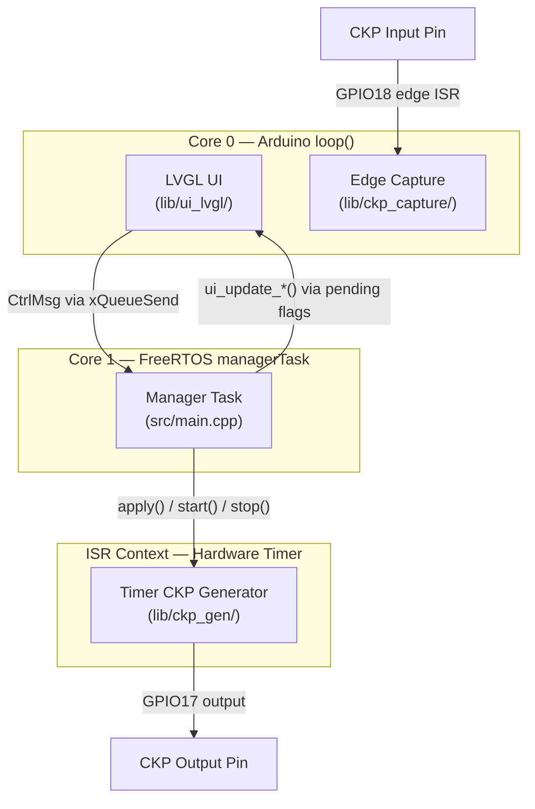
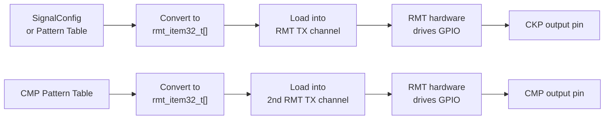

# ESP32 Crankshaft Signal Generator — Technical Report

> **Purpose**: This document is a comprehensive technical description of the ESP32-based CKP Signal Generator project. It is intended to be shared with an external collaborator whose Arduino-based signal generator project has a broader pattern library and table-driven signal representation. The goal is to provide enough detail for that programmer to assess how the two projects can be merged — specifically, how the pattern richness and table-driven approach of the Arduino project could be incorporated into this ESP32 platform, potentially via the ESP32 RMT peripheral.

---

## Table of Contents

1. [Project Requirements](#1-project-requirements)
2. [High-Level Architecture](#2-high-level-architecture)
3. [File Map & Module Responsibilities](#3-file-map--module-responsibilities)
4. [Signal Generation Subsystem (`lib/ckp_gen/`)](#4-signal-generation-subsystem-libckp_gen)
   - 4.1 [Configuration Model (`SignalConfig`)](#41-configuration-model-signalconfig)
   - 4.2 [Generator Interface (`IGenerator`)](#42-generator-interface-igenerator)
   - 4.3 [Timer-ISR Implementation (`TimerCkpGenerator`)](#43-timer-isr-implementation-timerckpgenerator)
   - 4.4 [ISR Slot-Machine Algorithm](#44-isr-slot-machine-algorithm)
   - 4.5 [Timing Derivation](#45-timing-derivation)
5. [Signal Capture Subsystem (`lib/ckp_capture/`)](#5-signal-capture-subsystem-libckp_capture)
6. [LVGL Touchscreen UI (`lib/ui_lvgl/`)](#6-lvgl-touchscreen-ui-libui_lvgl)
   - 6.1 [UI Public API](#61-ui-public-api)
   - 6.2 [Callback Typedefs](#62-callback-typedefs)
   - 6.3 [Thread-Safety Contract](#63-thread-safety-contract)
7. [Orchestration Layer (`src/main.cpp`)](#7-orchestration-layer-srcmaincpp)
   - 7.1 [Message Queue Protocol](#71-message-queue-protocol)
   - 7.2 [Manager Task](#72-manager-task)
   - 7.3 [Boot Sequence](#73-boot-sequence)
8. [Build Configuration & Dependencies](#8-build-configuration--dependencies)
9. [Predefined Patterns](#9-predefined-patterns)
10. [Current Limitations & Known Issues](#10-current-limitations--known-issues)
11. [Methodology Comparison: Timer-ISR vs. Table-Driven Generation](#11-methodology-comparison-timer-isr-vs-table-driven-generation)
12. [RMT Peripheral as a Potential Hybrid Path](#12-rmt-peripheral-as-a-potential-hybrid-path)

---

## 1. Project Requirements

The project implements a **crankshaft position sensor (CKP) signal generator and capturer** targeting ESP32 microcontrollers. Its functional requirements are:

| Requirement | Description |
|---|---|
| **Signal Generation** | Generate a deterministic, jitter-free digital CKP waveform from a GPIO pin using hardware timers |
| **Pattern Support** | Support configurable missing-tooth patterns (e.g., 60-2, 36-1, 36-2, 36-1-1, 12-1) with parametric gap position and gap logic level |
| **RPM Control** | Allow real-time RPM adjustment from 100 to 6000 RPM via UI or serial CLI |
| **Custom Patterns** | Allow the user to define arbitrary `nTeeth / pMiss / nMiss / gapPos / gapLvl` combinations at runtime |
| **Signal Capture** | Capture incoming CKP-like edges on a separate GPIO and report period/duty-cycle measurements |
| **Touchscreen UI** | Provide a full LVGL-based GUI on a 480×272 LCD (JC4827W543) with RPM arc dial, pattern dropdown, start/stop, invert, and custom pattern modal |
| **Output Inversion** | Optionally invert the entire output waveform in real time |
| **Dual-Target Build** | Support both ESP32-S3-N4R8 (with PSRAM and LCD) and ESP32-WROOM-32D (headless, serial only) |

> [!NOTE]
> The project does **not** currently support CMP (camshaft) signal generation, multi-channel output, or waveform visualization. These are features the reference Arduino project provides and are candidates for integration.

---

## 2. High-Level Architecture

The system follows a **three-layer architecture** with strict separation of concerns:



**Key architectural principles:**
- **No direct UI → Generator calls.** All user intent flows through a FreeRTOS queue (`gCtrlQ`) to the manager task.
- **ISR stays minimal.** The timer ISR (`onTimer()`) performs only bit-level slot computation and a register write — no heap allocations, no queue operations.
- **Thread-safe state sync.** The UI layer uses pending-flag variables guarded by a `portMUX_TYPE` spinlock to safely receive updates from the manager task running on a different core.

---

## 3. File Map & Module Responsibilities

```
├── src/
│   └── main.cpp                     # Orchestration: boot, manager task, message queue, CLI
├── lib/
│   ├── ckp_gen/
│   │   ├── CkpGenerator.h           # IGenerator interface, SignalConfig struct, TimerCkpGenerator class
│   │   └── CkpGenerator.cpp         # Timer setup, ISR slot-machine, apply/start/stop implementation
│   ├── ckp_capture/
│   │   ├── EdgePulseCapture.h        # CaptureReport struct, EdgePulseCapture class
│   │   └── EdgePulseCapture.cpp      # GPIO edge ISR, period/duty measurement, queue reporting
│   └── ui_lvgl/
│       ├── ui_lvgl.h                 # Public UI API: init, update, task_handler, callback typedefs
│       └── ui_lvgl.cpp               # LVGL display/touch port, styles, main screen, custom modal
├── include/
│   └── lv_conf.h                    # LVGL v9.2.2 configuration (16-bit color, FreeRTOS OS, 64KB pool)
└── platformio.ini                   # Build environments (esp32-s3-n4r8, esp32-wroom32d)
```

---

## 4. Signal Generation Subsystem (`lib/ckp_gen/`)

This is the heart of the project. It uses an ESP32 hardware timer to produce a deterministic CKP waveform through a "slot-machine" ISR.

### 4.1 Configuration Model (`SignalConfig`)

Defined in [CkpGenerator.h](file:///home/mfares/0.Projects/0.Signal_Generator/lib/ckp_gen/CkpGenerator.h#L18-L25):

```cpp
struct SignalConfig {
  uint32_t    rpm;        // 100..6000
  uint16_t    nTeeth;     // total teeth if no gaps (e.g., 60, 36)
  uint8_t     pMiss;      // number of gap periods per revolution
  uint8_t     nMiss;      // number of missing teeth per period
  GapPosition gapPos;     // GAP_AT_END or GAP_AT_START
  bool        gapLvl;     // gap level (false=LOW, true=HIGH)
};
```

**Parameter semantics:**

| Field | Meaning | Example for "60-2" |
|---|---|---|
| `nTeeth` | Total slot count as if no teeth were missing | 60 |
| `pMiss` | How many equally-spaced gap zones per revolution | 1 |
| `nMiss` | How many consecutive teeth are missing per gap zone | 2 |
| `gapPos` | Whether the gap occupies the **end** or **start** of each period | `GAP_AT_END` |
| `gapLvl` | The logic level held during the gap (LOW or HIGH) | `false` (LOW) |

The validation function [validateSignalConfig](file:///home/mfares/0.Projects/0.Signal_Generator/lib/ckp_gen/CkpGenerator.cpp#L44-L60) enforces:
- RPM ∈ [100, 6000]
- `nTeeth > 0`, `pMiss > 0`, `nMiss > 0`
- `nMiss < nTeeth`
- `slotsPerRev` must be evenly divisible by `pMiss`
- `gapSlots < slotsPerPeriod`

### 4.2 Generator Interface (`IGenerator`)

Defined in [CkpGenerator.h](file:///home/mfares/0.Projects/0.Signal_Generator/lib/ckp_gen/CkpGenerator.h#L31-L39):

```cpp
struct IGenerator {
  virtual bool begin(int pin) = 0;
  virtual bool apply(const SignalConfig& cfg) = 0;
  virtual void setInverted(bool inverted) = 0;
  virtual bool isInverted() = 0;
  virtual void start() = 0;
  virtual void stop() = 0;
  virtual ~IGenerator() = default;
};
```

This interface is **critical** for future extensibility. Any new generation backend (e.g., RMT-based, DMA-based) can be implemented behind this same interface without touching the orchestration layer or UI.

| Method | Contract |
|---|---|
| `begin(pin)` | Initialize hardware for the given GPIO. Returns `false` on failure. Must be called once. |
| `apply(cfg)` | Atomically reconfigure the running waveform. Returns `false` if `cfg` is invalid. Resets phase to slot 0. If already running, updates the timer period in-place. |
| `start()` | Begin waveform output. Starts the timer alarm. Idempotent. |
| `stop()` | Halt waveform output. Drives pin LOW. Idempotent. |
| `setInverted(bool)` | Toggle output polarity in real time. The inversion is applied inside the ISR. |

### 4.3 Timer-ISR Implementation (`TimerCkpGenerator`)

The class [TimerCkpGenerator](file:///home/mfares/0.Projects/0.Signal_Generator/lib/ckp_gen/CkpGenerator.h#L42-L89) implements `IGenerator` using an ESP32 hardware timer:

**Initialization ([begin](file:///home/mfares/0.Projects/0.Signal_Generator/lib/ckp_gen/CkpGenerator.cpp#L26-L41)):**
1. Configures the output GPIO as `OUTPUT`, drives LOW.
2. Creates a hardware timer at **1 MHz base frequency** (`timerBegin(1000000)`), meaning each tick = 1 µs.
3. Attaches the static ISR trampoline `onTimerStatic()` to the timer interrupt.
4. Stores a singleton pointer (`s_inst`) for the ISR callback.

**Configuration ([apply](file:///home/mfares/0.Projects/0.Signal_Generator/lib/ckp_gen/CkpGenerator.cpp#L62-L98)):**
1. Validates the config via `validateSignalConfig()`.
2. Computes derived values inside a critical section:
   - `slotsPerRev = 2 * nTeeth` (each tooth = 2 slots: HIGH then LOW)
   - `slotsPerPeriod = slotsPerRev / pMiss`
   - `gapSlots = 2 * nMiss`
   - `slot_us = 60,000,000 / (rpm × slotsPerRev)`
   - `gapStartSip` = precomputed slot index where the gap begins
3. Resets the phase counter to 0 and drives pin LOW.
4. If already running, calls `timerAlarm()` to update the period without stopping.

**Output ([start](file:///home/mfares/0.Projects/0.Signal_Generator/lib/ckp_gen/CkpGenerator.cpp#L119-L129) / [stop](file:///home/mfares/0.Projects/0.Signal_Generator/lib/ckp_gen/CkpGenerator.cpp#L131-L136)):**
- `start()` resets phase, sets `_running = true`, and activates the timer alarm with auto-reload.
- `stop()` sets `_running = false` and drives the pin LOW.

**GPIO writes** use direct register access for minimum latency:
```cpp
REG_WRITE(level ? GPIO_OUT_W1TS_REG : GPIO_OUT_W1TC_REG, (1U << _pin));
```

### 4.4 ISR Slot-Machine Algorithm

The ISR [onTimer](file:///home/mfares/0.Projects/0.Signal_Generator/lib/ckp_gen/CkpGenerator.cpp#L159-L198) fires once per **slot** (half-tooth period). At each invocation:

```
┌───────────────────────────────────────────────────────────────────┐
│ 1. Read current slot-in-period (sip)                              │
│ 2. Advance: nextSip = (sip + 1) % slotsPerPeriod                │
│ 3. Determine output level:                                        │
│    IF in gap zone → level = gapLvl (constant during gap)         │
│    ELSE           → level = alternating HIGH/LOW per slot parity │
│ 4. Apply inversion if _invertOutput is set                       │
│ 5. Write GPIO only if level changed (skip redundant writes)      │
│ 6. Update _gapWindow flag for external monitoring                │
└───────────────────────────────────────────────────────────────────┘
```

**Gap zone detection** depends on `gapPos`:
- **GAP_AT_END**: Gap occupies slots `[gapStartSip, slotsPerPeriod)`, where `gapStartSip = slotsPerPeriod - gapSlots`.
- **GAP_AT_START**: Gap occupies slots `[0, gapSlots)`.

**Tooth output logic** (outside the gap):
- For `GAP_AT_END`: `level = ((sip & 1) == (gapLvl ? 1 : 0))`
- For `GAP_AT_START`: `level = (((tooth_sip & 1) == 0) != gapLvl)`, where `tooth_sip = sip - gapSlots`

The entire ISR body executes inside `portENTER_CRITICAL_ISR` / `portEXIT_CRITICAL_ISR` to ensure atomicity with `apply()` calls from the manager task.

### 4.5 Timing Derivation

The fundamental timing equation:

```
slot_period_µs = 60,000,000 / (RPM × slotsPerRev)
```

Where `slotsPerRev = 2 × nTeeth`.

**Example — 60-2 pattern at 1000 RPM:**
```
slotsPerRev    = 2 × 60    = 120
slot_period_µs = 60,000,000 / (1000 × 120) = 500 µs
tooth_period   = 2 × 500 µs = 1000 µs = 1 ms
rev_period     = 120 × 500 µs = 60,000 µs = 60 ms
```

**Timer resolution**: 1 µs (1 MHz base). At the maximum spec (6000 RPM, 60 teeth):
```
slot_period_µs = 60,000,000 / (6000 × 120) = 83 µs
```
This gives ~83 timer ticks per slot, which is well within the ESP32 timer resolution limits.

> [!IMPORTANT]
> **Determinism**: Because the waveform is generated by a hardware timer ISR with direct register GPIO writes, jitter is bounded by ISR latency (~1–5 µs on ESP32-S3). This is a key advantage of this project's approach: the output waveform has hardware-level timing precision.

---

## 5. Signal Capture Subsystem (`lib/ckp_capture/`)

[EdgePulseCapture](file:///home/mfares/0.Projects/0.Signal_Generator/lib/ckp_capture/EdgePulseCapture.h#L14-L32) provides a simple edge-timing measurement subsystem:

**Data structure:**
```cpp
struct CaptureReport {
  uint32_t period_us;      // Time between consecutive rising edges
  uint32_t high_us;        // Duration of the HIGH phase
  uint32_t timestamp_us;   // micros() at the last rising edge
};
```

**Operation:**
1. `begin(pin)` — Configures a GPIO with a `CHANGE` interrupt and allocates a 16-deep FreeRTOS queue.
2. On each rising edge, records the period since the last rising edge.
3. On each falling edge, records the HIGH duration and sends a complete `CaptureReport` to the queue via `xQueueSendFromISR`.
4. `fetch(out, timeout_ms)` — Blocking dequeue from the application side.

**GPIO reads** use direct register access for ISR speed:
```cpp
(REG_READ(GPIO_IN_REG) & (1U << pin)) ? HIGH : LOW
```

> [!NOTE]
> The capture subsystem is currently **passive** — `main.cpp` calls `fetch()` with a 0-ms timeout every loop iteration but does not display or log the results. It is infrastructure for future signal analysis, loopback validation, or waveform display.

---

## 6. LVGL Touchscreen UI (`lib/ui_lvgl/`)

The UI runs on a **Guiton JC4827W543** display module (480×272 RGB565, GT911 capacitive touch) and uses **LVGL v9.2.2**.

### 6.1 UI Public API

Defined in [ui_lvgl.h](file:///home/mfares/0.Projects/0.Signal_Generator/lib/ui_lvgl/ui_lvgl.h):

| Function | Signature | Description |
|---|---|---|
| `ui_init` | `bool ui_init(on_rpm, on_pattern, on_run, on_custom, on_invert)` | Initialize display, touch, LVGL, create UI. Returns `false` on hardware failure. |
| `ui_task_handler` | `void ui_task_handler()` | Pump LVGL timers + apply pending backend→UI updates. Call from `loop()`. |
| `ui_update_rpm` | `void ui_update_rpm(uint32_t rpm)` | Thread-safe: set pending RPM for UI sync |
| `ui_update_pattern` | `void ui_update_pattern(uint8_t idx)` | Thread-safe: set pending pattern index |
| `ui_update_running` | `void ui_update_running(bool running)` | Thread-safe: set pending run state |
| `ui_update_inverted` | `void ui_update_inverted(bool inverted)` | Thread-safe: set pending invert state |
| `ui_show_error` | `void ui_show_error(const char* msg)` | Thread-safe: show/hide error label |
| `ui_is_ready` | `bool ui_is_ready()` | Returns `true` after successful `ui_init` |

### 6.2 Callback Typedefs

```cpp
typedef void (*ui_on_rpm_cb)(uint32_t rpm);
typedef void (*ui_on_pattern_cb)(uint8_t pattern_index);
typedef void (*ui_on_run_cb)(bool running);
typedef void (*ui_on_custom_cb)(const SignalConfig& cfg);
typedef void (*ui_on_invert_cb)(bool inverted);
```

These are registered at `ui_init()` time. The UI calls them from the LVGL thread (Core 0, `loop()` context) — they must **not block** and should only enqueue messages.

### 6.3 Thread-Safety Contract

The UI layer solves the Core 0 (UI) ↔ Core 1 (Manager) synchronization problem with a **pending-flags pattern**:

1. **Manager → UI**: The `ui_update_*()` functions set volatile flag/value pairs under a `portMUX_TYPE` spinlock (`s_ui_mux`).
2. **UI consumption**: `apply_pending_updates()` is called at the end of every `ui_task_handler()` invocation. It atomically reads and clears all pending flags under the same spinlock, then applies them to LVGL widgets **outside** the critical section.
3. **Callback suppression**: When programmatically updating a widget (e.g., `lv_arc_set_value`), the corresponding `s_suppress_*_cb` flag is set to prevent the widget's event handler from re-firing a callback — avoiding infinite feedback loops.

**Visual feedback**: When the backend confirms an RPM change, the RPM label flashes amber (`0xFFB020`) for 600 ms before reverting to cyan (`0x00E5FF`).

---

## 7. Orchestration Layer (`src/main.cpp`)

### 7.1 Message Queue Protocol

All user-initiated state changes flow through a single FreeRTOS queue:

```cpp
enum MsgType : uint8_t {
  MSG_SET_RPM,       // payload.val = rpm (int32_t)
  MSG_SET_PATTERN,   // payload.val = pattern index (int32_t)
  MSG_START,         // no payload
  MSG_STOP,          // no payload
  MSG_SET_CUSTOM,    // payload.cfg = full SignalConfig
  MSG_SET_INVERT     // payload.val = 0 or 1
};

union MsgPayload {
  int32_t      val;
  SignalConfig cfg;
};

struct CtrlMsg {
  MsgType    type;
  MsgPayload payload;
};
```

Queue: 16 elements deep, created with `xQueueCreate(16, sizeof(CtrlMsg))`.

**Send helper** ([sendCtrlMsg](file:///home/mfares/0.Projects/0.Signal_Generator/src/main.cpp#L79-L89)): Non-blocking (`timeout=0`). On failure, increments a drop counter and shows a UI error.

### 7.2 Manager Task

[managerTask](file:///home/mfares/0.Projects/0.Signal_Generator/src/main.cpp#L142-L233) runs on **Core 1**, priority 3, 4096-byte stack. It blocks on `xQueueReceive(gCtrlQ, ..., portMAX_DELAY)` and processes messages:

| Message | Action |
|---|---|
| `MSG_SET_RPM` | Clamp to [100, 6000], create new config, call `genTX.apply()`. On failure, revert to `lastGood` config. |
| `MSG_SET_PATTERN` | Clamp index to [0, 4], build config via `patternFromIndex()`, apply. On failure, revert. |
| `MSG_SET_CUSTOM` | Clamp RPM, apply full `SignalConfig`. On failure, revert. |
| `MSG_START` | `genTX.start()`, update UI. |
| `MSG_STOP` | `genTX.stop()`, update UI. |
| `MSG_SET_INVERT` | `genTX.setInverted()`, update UI. |

**Rollback pattern**: The manager maintains `lastGood` / `lastGoodPattern` snapshots. If `genTX.apply()` returns `false`, the system reverts to the last known-good state and notifies the UI.

### 7.3 Boot Sequence

[setup()](file:///home/mfares/0.Projects/0.Signal_Generator/src/main.cpp#L239-L278):

```
1. Serial.begin(921600)
2. genTX.begin(GPIO17)           — initialize timer + GPIO
3. capRX.begin(GPIO18)           — initialize capture ISR
4. ui_init(callbacks...)          — initialize display, touch, LVGL
5. xQueueCreate(16)              — create control message queue
6. xTaskCreatePinnedToCore(      — spawn managerTask on Core 1
     managerTask, "managerTask", 4096, nullptr, 3, nullptr, 1)
7. genTX.apply(default_config)   — 60-2 at 1000 RPM
8. genTX.start()                 — begin output immediately
9. UI sync (rpm, pattern, running, inverted)
```

The `loop()` function (Core 0) pumps the UI and polls the capture queue:
```cpp
void loop() {
  ui_task_handler();
  CaptureReport r{};
  (void)capRX.fetch(r, 0);
  vTaskDelay(pdMS_TO_TICKS(10));
}
```

---

## 8. Build Configuration & Dependencies

### Environments

| Environment | Board | PSRAM | Display | Use Case |
|---|---|---|---|---|
| `esp32-s3-n4r8` | ESP32-S3-DevKitC-1 | 8MB OPI | JC4827W543 (480×272) | Primary development, full UI |
| `esp32-wroom32d` | ESP32-WROOM-32D | None | None | Headless, serial-only control |

### Dependencies

| Library | Version | Purpose |
|---|---|---|
| LVGL | ^9.2.2 | Graphics framework for touchscreen UI |
| GFX Library for Arduino | ^1.5.6 | Display driver (Arduino_GFX RGB panel) |
| Dev Device Pins | ^0.0.2 | Pin definitions for JC4827W543 module |
| TAMC_GT911 | ^1.0.2 | Capacitive touch controller driver |

### Key Build Flags
```
-DARDUINO_USB_CDC_ON_BOOT=1   # USB serial via CDC
-DBOARD_HAS_PSRAM             # Enable PSRAM allocation
-DLV_CONF_INCLUDE_SIMPLE      # LVGL config via lv_conf.h
```

### LVGL Configuration Highlights
- **Color depth**: 16-bit (RGB565)
- **Memory pool**: 64 KB built-in allocator
- **OS integration**: `LV_OS_FREERTOS`
- **Refresh period**: 33 ms (≈30 FPS)

---

## 9. Predefined Patterns

Defined in [patternFromIndex](file:///home/mfares/0.Projects/0.Signal_Generator/src/main.cpp#L67-L77):

| Index | Name | nTeeth | pMiss | nMiss | gapPos | gapLvl | Typical Vehicle |
|---|---|---|---|---|---|---|---|
| 0 | 60-2 | 60 | 1 | 2 | END | LOW | Most common (Bosch, etc.) |
| 1 | 36-1 | 36 | 1 | 1 | END | LOW | Japanese vehicles |
| 2 | 36-2 | 36 | 1 | 2 | END | LOW | Various |
| 3 | 36-1-1 | 36 | 2 | 1 | END | LOW | Dual-gap (e.g., Renault) |
| 4 | 12-1 | 12 | 1 | 1 | START | HIGH | Special (gap-at-start, HIGH sync) |

Additionally, the UI provides a **CUSTOM** entry (dropdown index 5) that opens a modal panel where the user can specify arbitrary `nTeeth`, `pMiss`, `nMiss`, `gapPos`, and `gapLvl` values.

> [!WARNING]
> The current pattern library is limited to **5 presets + custom**. The reference Arduino project supports a significantly larger number of predefined CKP and CMP patterns. Expanding this library is a primary integration target.

---

## 10. Current Limitations & Known Issues

| Area | Limitation |
|---|---|
| **Pattern count** | Only 5 predefined patterns; no CMP signal support |
| **Waveform visualization** | No graphical representation of the generated signal pattern |
| **Web UI** | No remote control capability; requires physical touchscreen or serial |
| **Table-driven patterns** | The algorithmic (slot-machine) approach makes adding truly arbitrary waveforms (e.g., irregular tooth spacing, cam profiles) difficult — each pattern must be expressible as `nTeeth/pMiss/nMiss/gapPos/gapLvl` |
| **Single output channel** | Only one CKP output; no CMP output channel |
| **Capture unused** | `EdgePulseCapture` data is fetched but not displayed or logged |
| **Display orientation** | Historical issues with rotation and touch coordinate mapping (resolved in current code but noted in `project_state.json`) |

---

## 11. Methodology Comparison: Timer-ISR vs. Table-Driven Generation

This section highlights the fundamental difference between our signal generation approach and the approach used in the reference Arduino project.

### Our Approach: Algorithmic Timer-ISR ("Slot Machine")

```
┌──────────────────────────────────────────────────┐
│  Hardware Timer fires every slot_period_µs       │
│  ↓                                               │
│  ISR reads slot counter → computes level → GPIO  │
│  ↓                                               │
│  Advance slot counter, wrap at slotsPerPeriod    │
└──────────────────────────────────────────────────┘
```

**Strengths:**
- ✅ Extremely low memory footprint (a few volatile integers)
- ✅ Hardware-deterministic timing — jitter is bounded by ISR latency (~1–5 µs)
- ✅ RPM changes are instantaneous (just update `timerAlarm` period)
- ✅ Simple for regular missing-tooth patterns

**Weaknesses:**
- ❌ Every pattern must be expressible through the `SignalConfig` parameterization (`nTeeth`, `pMiss`, `nMiss`, `gapPos`, `gapLvl`)
- ❌ Cannot represent irregularly-spaced teeth, multi-level signals, or CMP cam profiles
- ❌ Adding a new pattern type may require modifying the ISR logic itself
- ❌ No inherent mechanism for multi-channel synchronized output (CKP + CMP)

### Reference Arduino Approach: Table-Driven Output

```
┌──────────────────────────────────────────────────┐
│  Pattern stored as array of output values        │
│  e.g., uint8_t pattern[] = {1,0,1,0,...,0,0,0,0} │
│  ↓                                               │
│  Timer iterates through array at computed rate    │
│  ↓                                               │
│  Each entry directly sets GPIO level              │
└──────────────────────────────────────────────────┘
```

**Strengths:**
- ✅ Any arbitrary waveform can be represented — just list the output levels
- ✅ CMP patterns are just additional parallel tables
- ✅ Adding new patterns requires only new data, not new logic
- ✅ Visualization is trivial — the table *is* the waveform
- ✅ Multi-channel synchronization is natural (index both CKP and CMP tables with the same counter)

**Weaknesses:**
- ❌ Higher memory usage (one byte per slot per channel per pattern)
- ❌ RPM changes require recalculating the timer period
- ❌ Large tooth counts (e.g., 60-2 = 120 slots) × many patterns = significant flash/RAM

### Summary

| Criterion | Timer-ISR (Ours) | Table-Driven (Arduino Ref) |
|---|---|---|
| Memory per pattern | ~0 (computed) | O(2 × nTeeth) bytes |
| Arbitrary waveform support | Limited to `SignalConfig` params | Any shape |
| CMP support | Not possible without ISR changes | Natural (parallel table) |
| Pattern addition effort | May need ISR logic changes | Data-only change |
| Timing determinism | Excellent (HW timer + direct GPIO) | Good (timer + array lookup) |
| Visualization | Requires separate computation | Table = visual data |

---

## 12. RMT Peripheral as a Potential Hybrid Path

> [!IMPORTANT]
> This section documents a prospective architectural direction. **No decision has been made.** The intent is for the reviewing programmer to evaluate this path against the realities of both codebases.

The ESP32 family includes an **RMT (Remote Control Transceiver)** peripheral originally designed for IR remote protocols. It is particularly well-suited as a potential replacement or supplement to the current timer-ISR approach because:

### RMT Capabilities Relevant to CKP Generation

1. **Hardware-driven output**: RMT generates precise pulse sequences entirely in hardware — once a pattern is loaded, the CPU is not involved in timing. This eliminates ISR jitter entirely.

2. **Table-driven by nature**: RMT consumes an array of `rmt_item32_t` structures, where each item specifies:
   ```
   { duration0 (in ticks), level0 (HIGH/LOW), duration1 (in ticks), level1 (HIGH/LOW) }
   ```
   This is conceptually identical to the table-driven approach of the Arduino project, but executed in dedicated hardware.

3. **DMA support (ESP32-S3)**: On the S3, RMT channels can be fed via DMA, enabling very long patterns without ping-pong buffer management.

4. **Multiple channels**: The ESP32-S3 has 4 TX channels and 4 RX channels. Two TX channels could drive **CKP + CMP simultaneously** with hardware-level synchronization.

5. **Looping**: RMT supports automatic looping of the pattern buffer, making continuous revolution output straightforward.

### How It Could Work



### Potential Advantages Over Current Timer-ISR

| Advantage | Detail |
|---|---|
| **Zero-jitter output** | Hardware generates the waveform; no ISR latency |
| **Table-driven compatibility** | Directly accepts the Arduino project's table format (after conversion) |
| **Multi-channel sync** | CKP + CMP from synchronized RMT channels |
| **CPU freed** | The CPU is entirely uninvolved during output — available for UI, capture, etc. |
| **Arbitrary waveforms** | Any pattern expressible as a sequence of timed HIGH/LOW states |

### Challenges to Consider

| Challenge | Detail |
|---|---|
| **RPM changes** | Changing RPM requires recomputing all durations and reloading the buffer; not as instant as changing `timerAlarm` |
| **Memory** | RMT items are 4 bytes each; a 60-2 pattern = 120 items = 480 bytes per channel |
| **Buffer management** | For continuous looping, the end-of-transmission callback must reload or ping-pong buffers seamlessly |
| **API complexity** | The ESP-IDF RMT driver (especially v5.x) has a more complex API than simple timer setup |
| **Existing `IGenerator` contract** | The interface would need to accommodate pre-computed buffers vs. on-the-fly computation |

### Preserving the Current Interface

The existing `IGenerator` interface could accommodate an RMT backend:
- `begin(pin)` → configure RMT channel for the given GPIO
- `apply(cfg)` → convert `SignalConfig` (or a raw table) to `rmt_item32_t[]`, load into channel
- `start()` / `stop()` → enable/disable RMT transmission
- `setInverted()` → regenerate the buffer with inverted levels

An additional method or overloaded `apply()` could accept a raw pattern table directly, bridging the Arduino project's data format.

> [!CAUTION]
> The decision on whether to adopt RMT, retain the timer-ISR, or use a hybrid approach should be made after the reviewing programmer has assessed:
> 1. The actual pattern data format and size of the Arduino project's table library
> 2. Whether CMP synchronization is a requirement
> 3. The acceptable RPM-change latency
> 4. Memory constraints on the target ESP32 variant
>
> This report intentionally leaves the decision open.

---

*Document generated from codebase analysis on 2026-05-20. All file references point to the current state of the repository at `/home/mfares/0.Projects/0.Signal_Generator/`.*
